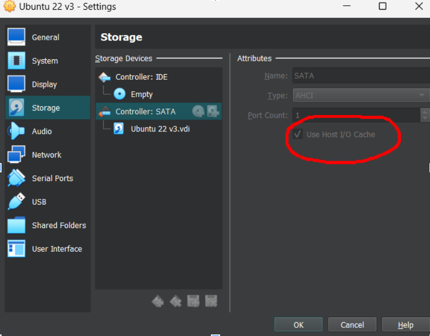
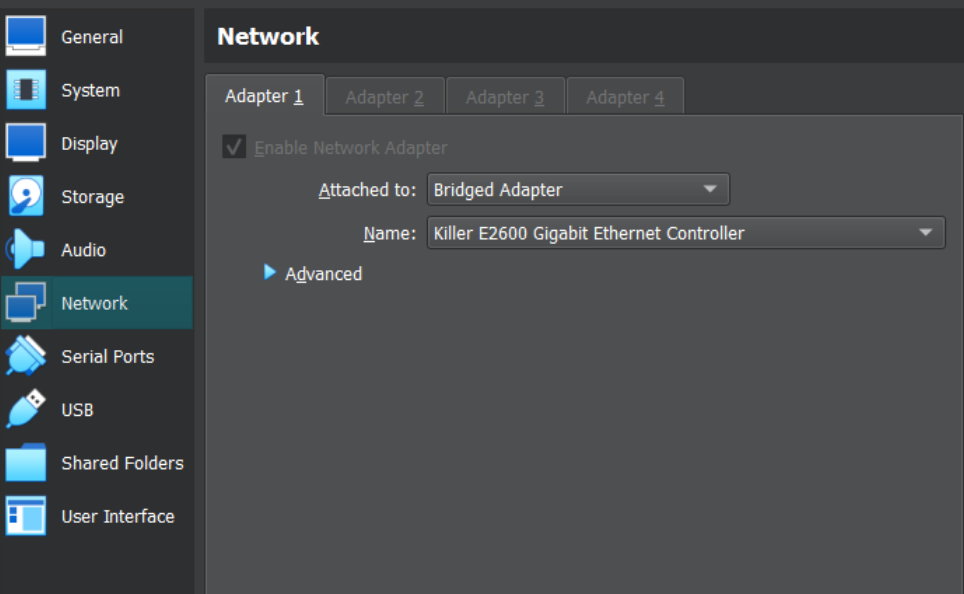

# Virtual Box VM Installation Guide

1. Download [VM VirtualBox](https://www.virtualbox.org/wiki/Downloads)
2. Download [ISO image](https://releases.ubuntu.com/jammy/)
3. Open VM Virtual BOX as administrator
4. Create Virtual Machine - select downloaded ISO file and set resources
    - minimum 25GB storage
    - minimum 4CPU cores
    - minimum 8GB RAM  
    - <b>IMPORTANT</b> -> go to Virtual Machine settings -> storage -> check Use Host I/O Cache
    <p align="center">
    
    </p>
5. Start the VM and install ubuntu, create a user with password and continue. After installation, skip all unnecessary steps and continue by next step.
6. Change language to English, Canada (in settings) so the terminal works (this is actually bug)
7. bash

```bash
su root
nano /etc/sudoers
 <user_name> ALL=(ALL) ALL # this adds priviligies to use SUDO command


#install docker https://docs.docker.com/engine/install/ubuntu/
sudo apt-get update
sudo apt-get install ca-certificates curl
sudo install -m 0755 -d /etc/apt/keyrings
sudo curl -fsSL https://download.docker.com/linux/ubuntu/gpg -o /etc/apt/keyrings/docker.asc
sudo chmod a+r /etc/apt/keyrings/docker.asc

# Add the repository to Apt sources:
echo  "deb [arch=$(dpkg --print-architecture) signed-by=/etc/apt/keyrings/docker.asc] https://download.docker.com/linux/ubuntu \
 $(. /etc/os-release && echo "$VERSION_CODENAME") stable" | \
sudo tee /etc/apt/sources.list.d/docker.list > /dev/null
sudo apt-get update
sudo apt-get install docker-ce docker-ce-cli containerd.io docker-buildx-plugin docker-compose-plugin

# try if the docker works, the image should be downloaded an run
sudo docker run hello-world


# create docker accound if not already done and login into it
docker login -u <username>

# install tools
sudo apt-get install autoconf build-essential automake libtool pkg-config gcc-12
sudo apt install net-tools
```

Download [ethercat install script](compile_and_start_ethercat.sh)
```bash
# install ethercat
sudo bash ~/Downloads/compile_and_start_ethercat.sh #it will probably fails, it is OK

# download docker image with ros2 installed
sudo docker pull jakubivan5/sensorob_ros2:1.2 #check if it is the latest version on dockerhub.com

```

---

Now shut down virtual machine and change the network adapter in settings to bridged adapter
<p align="center">

</p>

---

Turn on virtual machine
```bash

# fix display access
xhost +local:root

#edit ec_master adress
ifconfig  # get eth adress from “enpxx” interface

sudo nano /etc/sysconfig/ethercat #add adress to empty quotation marks

# start ethercat
sudo /etc/init.d/ethercat start

# now verify if you see ethercat slaves (cable plugged in, OFC)
ethercat slaves # it should list connected slaves
```
Expected output is list of connected slaves
```
jakub@Linux-Jakub:~/ros2_ws$ ethercat slaves
0  0:0  PREOP  +  SENSO-Joint
1  0:0  PREOP  +  SENSO-Joint
```

If you don’t see your connected slaves, run compilation script for ethercat and again fill ec_master adress from “ifconfig” list

```bash
# now run docker container
sudo docker run -it --rm --network host --privileged -e DISPLAY=$DISPLAY -v /lib/modules:/lib/modules  -v /tmp/.X11-unix:/tmp/.X11-unix -v /usr/src/linux-headers-$(uname -r):/usr/src/linux-headers-$(uname -r) jakubivan5/sensorob_ros2:1.2 bash
```


