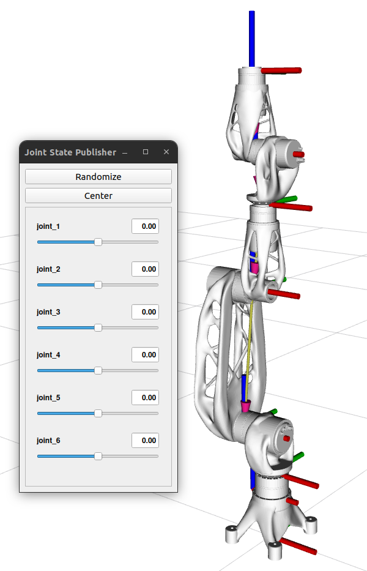
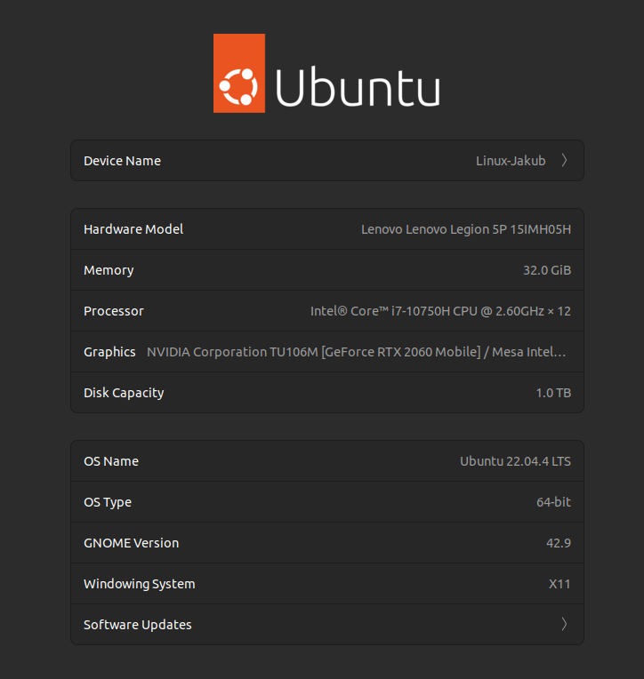

# SensoRob

This code is the product of Master's thesis

### THE SIMULATION AND TRAJECTORY PLANNING OF THE SENSOROB MANI ROBOT IN ROS2

available on https://opac.crzp.sk/?fn=detailBiblioForm&sid=4F9CB80EDA44B4B664083C797770

---
## Code structure
Code is separated accordingly:

- ${\textsf{\color{#ff5c64}sensorob description}}$
    - [[readme]](sensorob_description/README.md)
    - meshes
    - <b>config</b> file for joint parameters (position limits, velocity, acceleration, dynamic attributes for simulation)
    - <b>urdf</b> file defining relations between links creating joints
    - <b>ros2 control</b> file defining command and state interfaces for simulated and real systems
- ${\textsf{\color{#ff5c64}sensorob moveit config}}$
    - [[readme]](sensorob_moveit_config/README.md)
    - config files
    - launch files
- ${\textsf{\color{#ff5c64}sensorob}}$
    - [[readme]](sensorob/README.md)
    - config files related to
        - joints driver config
        - controllers
        - simulation
    - launch files
- ik algorithms
    - ${\textsf{\color{#ff5c64}ikfast plugin}}$
    - ${\textsf{\color{#ff5c64}tracik plugin}}$
- interfaces 
    - ${\textsf{\color{#ff5c64}ik}}$
        - [[readme]](interfaces/sensorob_ik/README.md)
        - package about Inverse Kinematics algorithms comparison
    - ${\textsf{\color{#ff5c64}planner}}$
        - [[readme]](interfaces/sensorob_planner/README.md)
        - package about Planning algorithms comparison
    - ${\textsf{\color{#ff5c64}trajectory logger}}$
        - [[readme]](interfaces/sensorob_trajectory_logger/README.md)
        - package about comparing the robot movements
        - [video on YouTube](https://www.youtube.com/watch?v=RKF1KTUG6-I)
- ${\textsf{\color{#ff5c64}moveit2}}$ <i>(external)</i>
    - https://github.com/Jakubivan/moveit2/tree/ivan/humble-w-stomp
- ${\textsf{\color{#ff5c64}ethercat driver for ros2}}$  <i>(external)</i>
    - https://github.com/Jakubivan/ethercat_driver_ros2/tree/main

## Setup and install

0. Use Linux 22.04 (we recommend RT Kernel)

    Developed on:

1. Install ROS2
2. Create working directory (for instance `/ros2_ws`)
3. Download this repository to working directory under `/src` folder
    
    At this time the `/ros2_ws/src/SensoRob` should be present
4. Run `colcon build --symlink-install`
    
    All packages should build within 30mins
5. Install EtherLab when working with the real robot (see [ethercat install readme](ethercat_driver_ros2/INSTALL.md))

## Usage

Launch one of the systems (see [sensorob package](sensorob/README.md))

Depending whether you want to perform some tests, launch one of the launch file in `interfaces` directory:

- ${\textsf{\color{#ff5c64}interfaces}}$ 
    - [sensorob ik](interfaces/sensorob_ik/README.md) - use with <b>mocked/simulated</b> system only
    - [sensorob planner](interfaces/sensorob_planner/README.md) - use with <b>mocked/simulated</b> system only
    - [sensorob trajectory logger](interfaces/sensorob_trajectory_logger/README.md) - use with <b>mocked/simulated/real</b> system only

