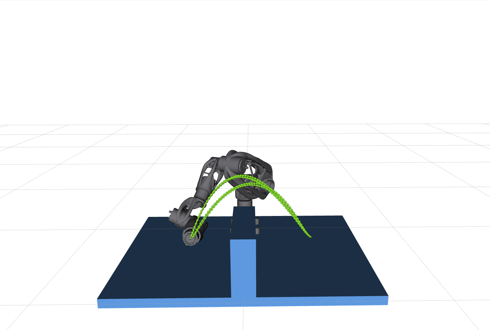
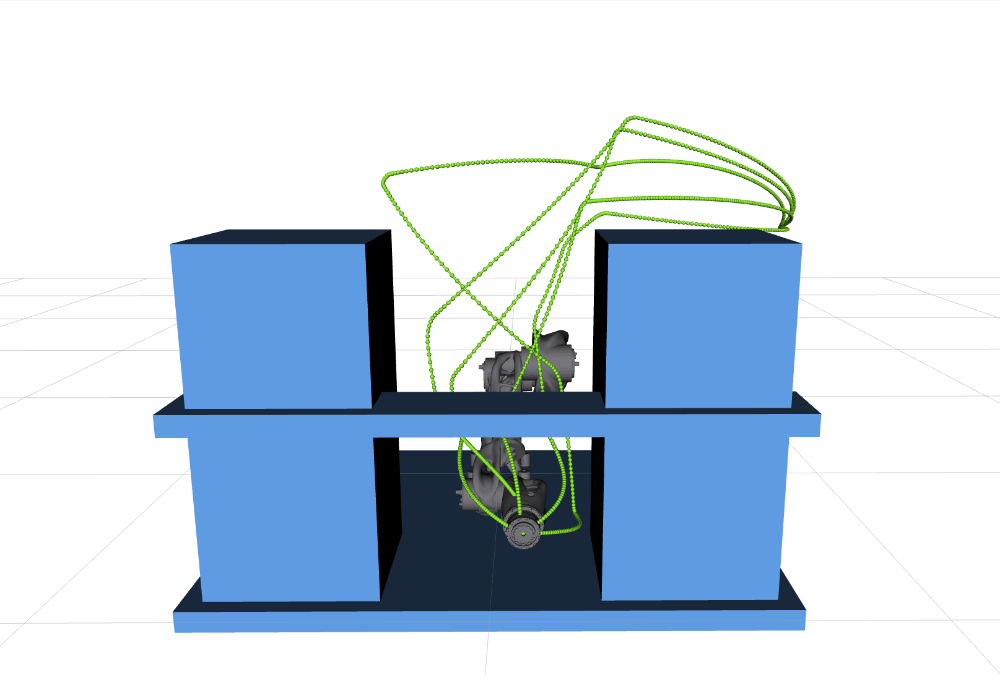

# Sensorob planning algorithm tests package

## General
This package performs planning algorithm tests.


## Description
We created IK solver tests as followed:

- add pedestal
- create planning scene 1
    - add 1 vertical obstacle infront of the robot
- solve planning requests in a loop (num_rerun)
- remove planning scene 1
- create planning scene 2
    - add 2 vertical obstacles infront of the robot
    - add 1 horizontal obstacle infront of the robot
- solve planning requests in a loop (num_rerun)
- remove planning scene 2
- remove pedestal

<p align="center">


</p>

In the planning scene 1 there is an option to plan under orientation constraints when launch argument `planning`  is set to `constrained`. The default value is `non-constrained`.

Several files are saved to `sensorob_logs` folder with the data regarding the planned trajectories. The mode of file logging is `dont`, `compact` (only average results) and `full`.

---

## Launch
The simulation has to be launched first, e.g.   
```
ros2 launch sensorob moveit_mock.launch.py
```

Then the IK solver test is ready to run  (run in second terminal)
```
ros2 launch sensorob_planner planner.launch.py
```

Use `-s` argument to see all the arguments, for instance:  
```
ros2 launch sensorob_planner planner.launch.py -s
```

```
Arguments (pass arguments as '<name>:=<value>'):

    'num_rerun':
        [uint] Number of rerunning the whole planning process with logging for each scene
        (default: '10')

    'file_logging':
        [dont, compact, full]
Logging mode
 - dont:    no logging
 - compact: only logging the final result
 - full:    logging the whole planning process (including all reruns and all scenes)
        (default: 'dont')

    'planning':
        [dont, non-constrained, constrained]
Mode of the planner
 - dont:            no planning, only adding obstacles
 - non-constrained: planning non-constrained movements
 - constrained:     planning both constrained and non-constrained movements
        (default: 'non-constrained')

    'planner_id':
        [RRTConnect, RRTstar, RRT, TRRT, EST, LBTRRT, BiEST, STRIDE, BiTRRT, PRM, PRMstar, LazyPRMstar, FMT, PDST, STRIDE, BiEST, STRIDE, BiTRRT, STOMP, CHOMP, pilz-PTP, pilz-CIRC, pilz-LIN]
ID of the planner to be used for planning
        (default: 'RRTConnect')

```

During the test there are prints (hints) in second terminal where ik_interface was launched about progress.
Also `Press 'next' in the RvizVisualToolsGui window to ...` is printed, so user can sequentially continue by clicking on the button in RViZ.