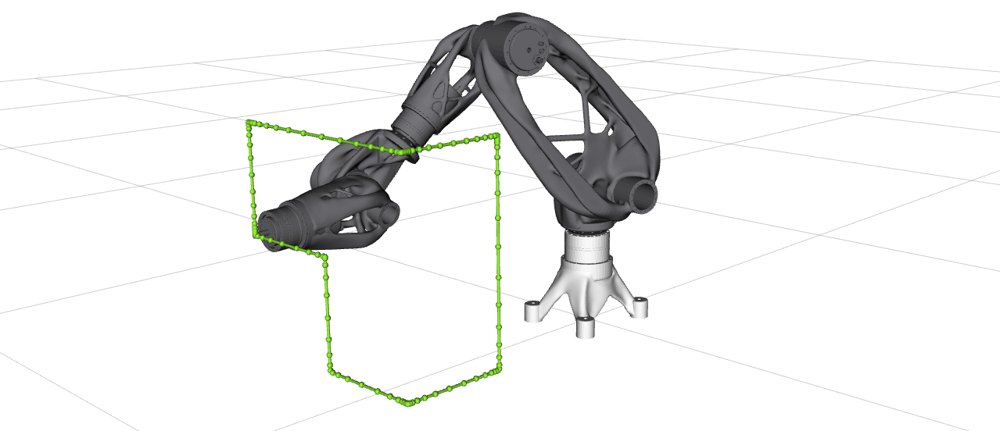
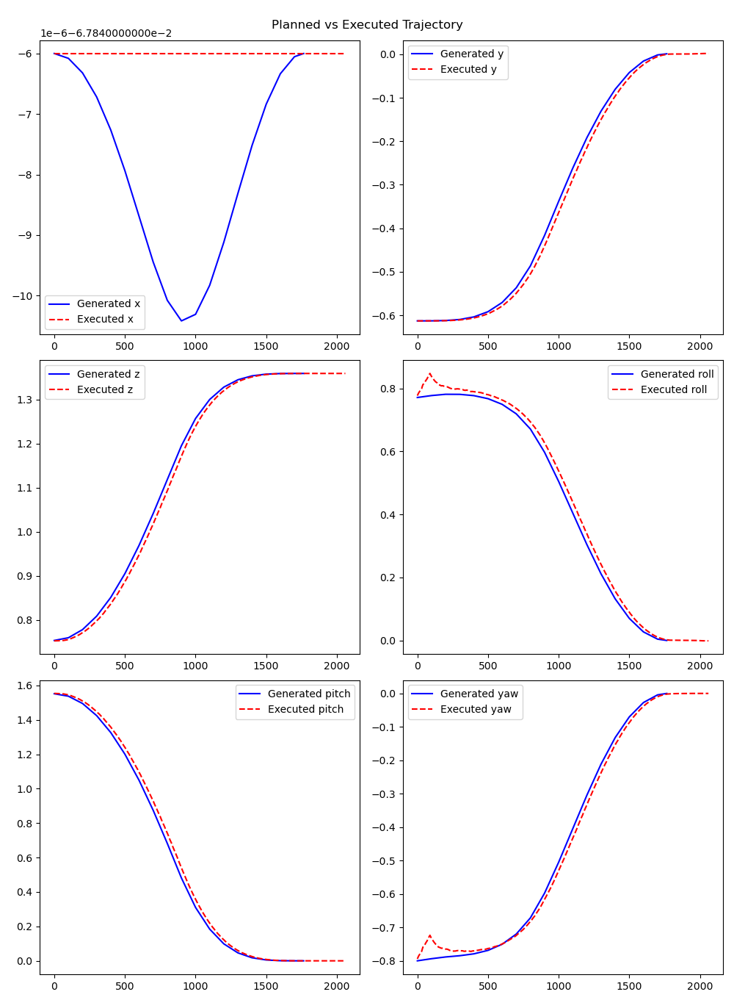

# Sensorob Trajectory Logger

This package provides a trajectory logger for the Sensorob robot.

## Launch Arguments

The following launch arguments are available:

- `using_fake_robot`: The variable determining if the sim_time should be used (for Gazebo system), or not (for Real system). Mock system is not affected by the parameter.

Usage:
```bash
ros2 launch sensorob_trajectory_logger trajectory_logger.launch.py using_fake_robot:=False
```

<p align="center">

</p>

## Code Flow

1. The script loads `config.yaml` (described below)
2. The `trajectory_logger` and `joint_state_listener` nodes are created
3. The frequency ratio is measured - the ratio between the actual joint states frequency and the desired frequency. The higher desired frequency, the better results for calcualting the mean square error, but the more computational resources needed.
3. Velocity and acceleration max scaling factor are set for `move_group` node
4. Planner with its pipeline is set
5. A directory for logging is created under the `sensorob_logs` folder
6. The robot is moved to the start position
7. Depending on the mode selecte:
- movement_mode: 0 (Joint space) the trajectory is generated from `JointStateTarget1` to `JointStateTarget2` and saved to a file
- movement_mode: 1 (Cartesian space) the trajectory is generated from `JointStateTarget1` using waypoint from config file and saved to a file
8. Joint state listener node starts listen to joint states and logs them to a file
9. Robot executes generated movement and joint state listener saves the joint state data
10. EEF pose are calculated for both trajectories
11. The error is computed
12. The eef poses - XYZ and RPY are visualized using python script into graphs

<p align="center">

</p>


## Configuration

The `config.yaml` file contains the following parameters:


`movement_mode` 0 - joint space, 1 - cartesian space \
`desired_frequency` Hz - how often the robot state is logged
`planner_id` [ RRTConnect, RRTstar, RRT, TRRT, EST, LBTRRT, BiEST, STRIDE, BiTRRT, PRM, PRMstar, LazyPRMstar, FMT, PDST, STRIDE, BiEST, STRIDE, BiTRRT, STOMP, CHOMP, pilz-PTP, pilz-CIRC, pilz-LIN]\
`max_velocity_scaling_factor`
`max_acceleration_scaling_factor`
`joint_value_target_1`  joint start position
`joint_value_target_2` # joint end position for movement_mode: 0
`waypoints` xyz list of wps for movement_mode: 1
 
Example of config file:

```
movement_mode: 1 
desired_frequency: 100 
planner_id: RRTConnect 
max_velocity_scaling_factor: 0.6
max_acceleration_scaling_factor: 0.6

joint_value_target_1: [0.8998244, 0.764909, -1.07867, 1.35929, -0.92911, 1.227445]
joint_value_target_2: [0.0, 0.0, 1.4, 0.0, 0.0, 1.50]  

waypoints: 
  - [0.6, 0.0, 0.0]  #x + 0.6m
  - [0.0, 0.0, 0.1]  #y - 0.1m
```
