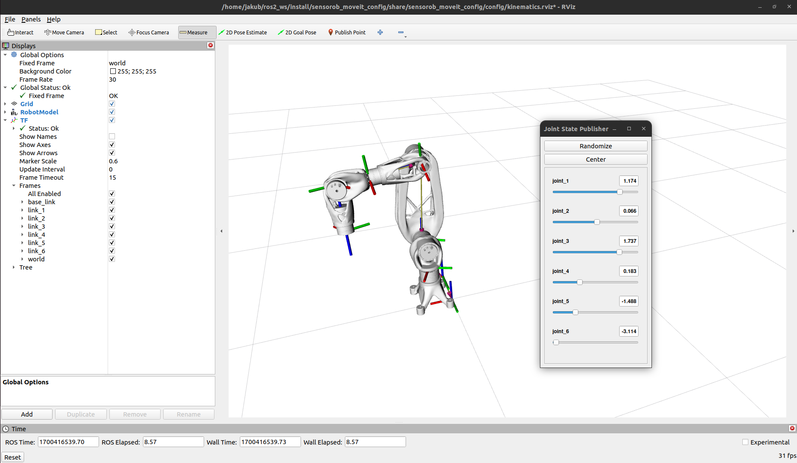
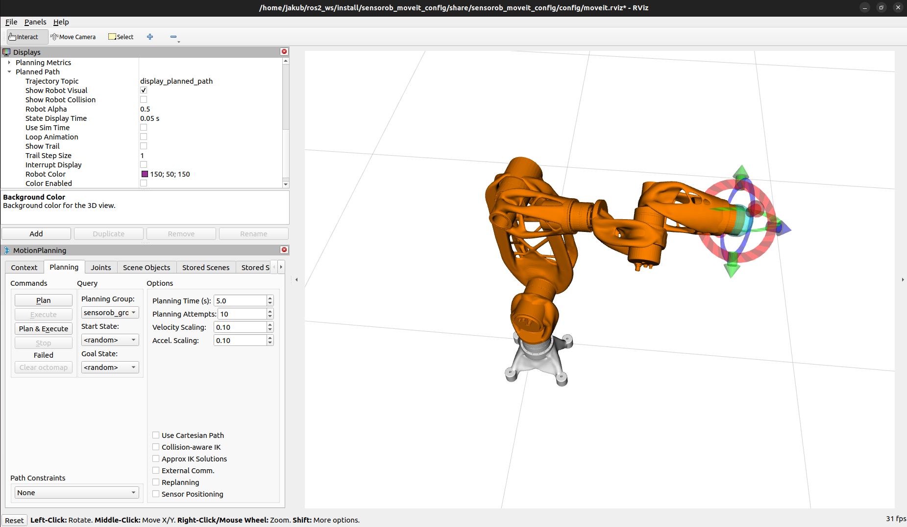
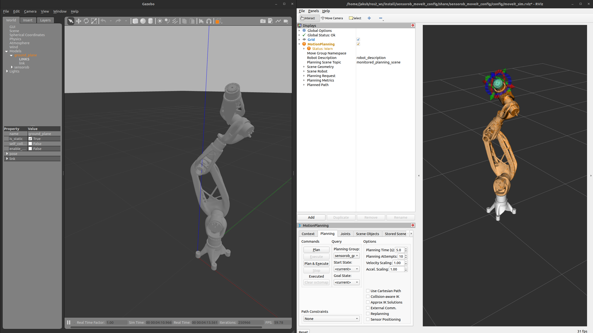

# Sensorob simulation package

## General
In config folder there is stored info about ROS2 Controllers.  
We are using `sensorob_group_controller` of type `joint_trajectory_controller/JointTrajectoryController`

The launch folder stores python launch files.

---
## Launch
### Kinematics  
In order to launch robot kinematics, type the following command in the terminal:
```
ros2 launch sensorob kinematics.launch.py
```

<p align="center">

</p>

### Moveit + mock joint states
In order to launch the move group node with simulated mock joint states, type the following command in the terminal:
```
ros2 launch sensorob moveit_mock.launch.py 
```

<p align="center">

</p>

### Moveit + simulated robot in Gazebo
In order to launch the move group node with simulated joint states published by robot model in Gazebo, type the following command in the terminal:
```
ros2 launch sensorob moveit_sim.launch.py 
```

<p align="center">

</p>

### Moveit + real robot
In order to launch the move group node with real hardware, type following command in the terminal

```
ros2 launch sensorob moveit_real.launch.py
```

<p align="center">
  <video src"https://github.com/sensoMarek/SensoRob/blob/doc_and_minor_config_changes/media/videos/sensorob_real.gif" width="70%" controls autoplay loop>
    title="MoveIt with real motor"
    Your browser does not support the video tag.
  </video>
</p>